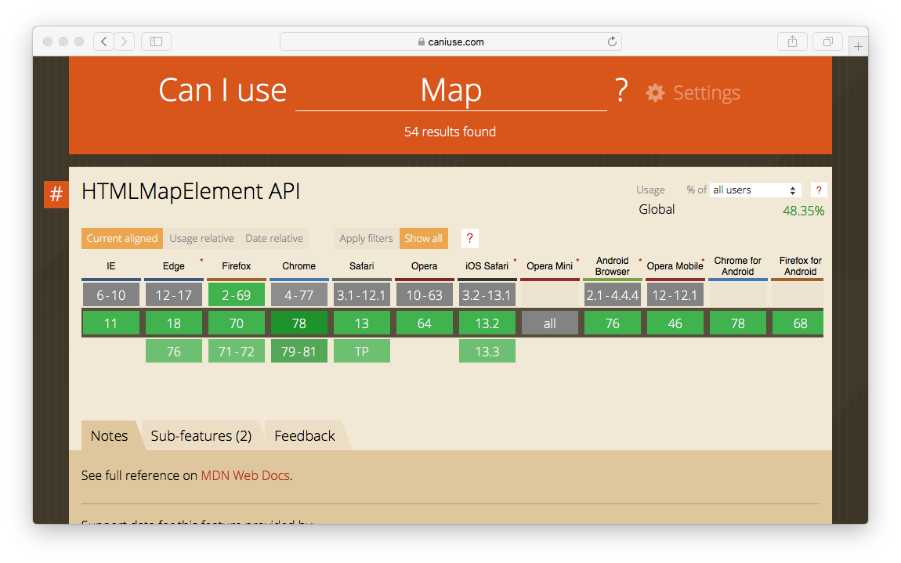
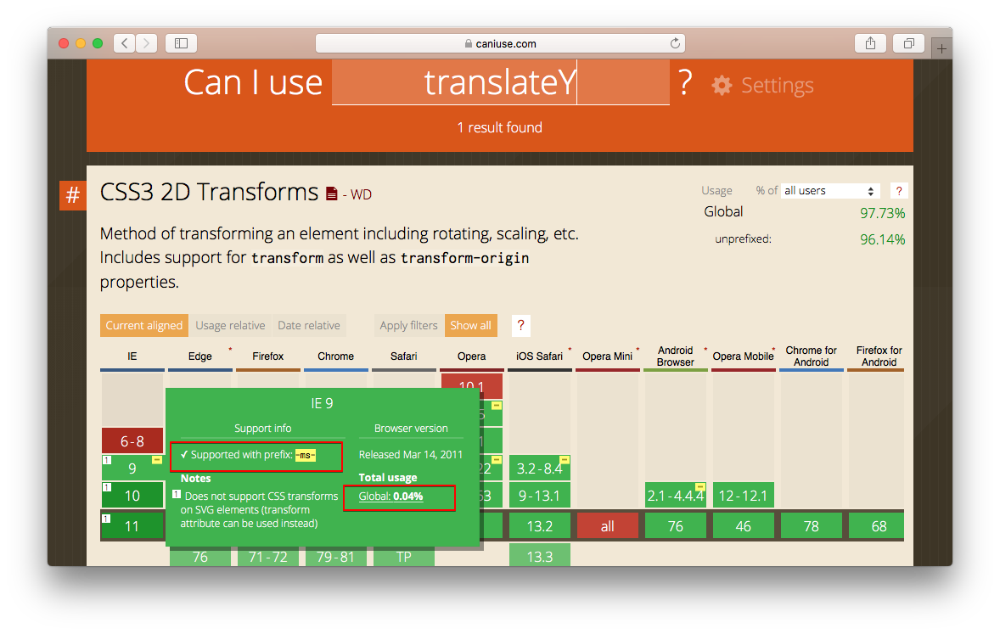

# From-ES2015-To-Babel-Preset-Env

由于 `ES6+` 在不同浏览器，不同版本的支持程度不同，因此出现了各种 `plugin` 去编译转换 `es6 to es5`. 如 `babel-preset-es2015` `babel-preset-es2016` ...  
而随着发展 `babel-preset-env` 产生了，它 `统一综合` 了上边提到的语法转化插件，提供了统一管理不同浏览器、版本、环境等的配置，这样我们就能根据自已的需要（`根据需要支持的浏览器、版本、环境、语法转换到什么程度`）进行自定义，**根据配置自动确定需要的plugin和polyfill**.  

而目前 `babel` 最新版本为 `7` ，在这个版本中babel放在了npm private scope 中(作用域)，所有7的插件都有`@babel/`前缀，而这个在 `babel6`中是没有的，因此使用时需要主要判断使用的是 *6还是7*  

**env** 是不包含 `stage-x` 的，需要的话需要自己配置安装，而stage的插件命名也添加了`-proposal`，标明这个插件是建议提案中的，随时会改动，不一定会出现在规范中.

下边对 [`@babel/preset-env`](https://babeljs.io/docs/en/babel-preset-env) 进行简单介绍.


## @babel/preset-env 主要参数

- targets
- targets.node
- targets.browsers : **指定打包出来的 `JS` 运行在哪些浏览器**
- spec : 启用更符合规范的转换，但速度会更慢，默认为 false
- loose：是否使用 loose mode，默认为 false
- modules：将 ES6 module 转换为其他模块规范，可选 "adm" | "umd" | "systemjs" | "commonjs" | "cjs" | false，默认为 false
- debug：启用debug，默认 false，**也似乎不管用啊**
- include：一个包含使用的 plugins 的数组
- exclude：一个包含不使用的 plugins 的数组
- useBuiltIns：为 polyfills 应用 `@babel/preset-env`，现在推荐使用 `core-js` ，可选 "usage" | "entry" | false，默认为 false

## stage-x

`stage-0` 包含 `stage-1` 包含 `stage-2` 包含 `stage-3` 包含 `stage-4`

## 详细介绍

### targets

> 都说是指定打包目标环境的啦，就是你想在什么样的机器上运行

#### targets.browsers

上文加粗的文字，是我的一个防入坑提醒，**大家都知道除了JS有兼容，CSS也是有兼容的对吧，而我以为设置了这个browsers指定的版本，`Autoprefixer`也能为我们加上对应的前缀 `-ms-`，可是 `我错啦*3`，babel是处理JS的，你怎么能让他指定CSS的处理方式呢，So...** 
> CSS的配置应该参考 [**browserslist**](https://github.com/browserslist/browserslist)

### **useBuiltIns**

> 上边已提到 **根据配置自动确定需要的plugin和polyfill**，而这个参数也正是配合使用的，以 `IE9` 为例

#### entry

插件会为我们自动添加 `所有IE9` 下没有的新特性，如 `Array.*` `Map` `Math.*` `Number.*` `String.*` 等等，

[在线参考](https://babeljs.io/repl#?babili=false&browsers=ie%20%3E%3D%209&build=&builtIns=entry&spec=false&loose=false&code_lz=JYWwDg9gTgLgBAIgMbQKYFoBWBnBBuIA&debug=false&forceAllTransforms=false&shippedProposals=false&circleciRepo=&evaluate=false&fileSize=false&timeTravel=false&sourceType=module&lineWrap=true&presets=env&prettier=false&targets=&version=7.7.4&externalPlugins=)

```js
// Input
import "core-js"; // 注意到了吗，我们还没写其他代码，就引入了浏览器所有没有的新特性

// Output

"use strict";

require("core-js/modules/es6.array.copy-within");

require("core-js/modules/es6.array.fill");

require("core-js/modules/es6.array.find");

require("core-js/modules/es6.array.find-index");

require("core-js/modules/es7.array.flat-map");

require("core-js/modules/es6.array.from");

省略...
```

#### usage

而 `usage` 参数是根据我们在项目中使用到的 `类` 或 `方法` 添加对应的补丁。

[在线参考](https://babeljs.io/repl#?babili=false&browsers=ie%20%3E%3D%209&build=&builtIns=usage&spec=false&loose=false&code_lz=JYWwDg9gTgLgBAIgMbQKYFoBWBnBBuAKAJQDtt4QBDMOAXjhNQHc4BZagCgEo8g&debug=false&forceAllTransforms=false&shippedProposals=false&circleciRepo=&evaluate=false&fileSize=false&timeTravel=false&sourceType=module&lineWrap=true&presets=env&prettier=false&targets=&version=7.7.4&externalPlugins=)

```js
// Input
import "core-js";

const map = new Map(); // 按使用加载

// Output
"use strict";

require("core-js/modules/web.dom.iterable");

require("core-js/modules/es6.array.iterator");

require("core-js/modules/es6.object.to-string");

require("core-js/modules/es6.string.iterator");

require("core-js/modules/es6.map");

var map = new Map();
```

## browserslist

说说其他的！ [**browserslist**](https://github.com/browserslist/browserslist) 是一个浏览器属性或方法支持程度的查询规则，他会通过 [`Can i use`](https://caniuse.com/) 去查询对应的数据，如 `Map` 方法，`transforms` 属性

<div align="center">
    
    
</div>

注意: 第二张图红框的内容，这个数据也正是我们需要添加的 `CSS前缀`，以及浏览器的 `市场占有率`。

## 参考

- [Babel](https://babeljs.io/docs/en/)
- [browserslist](https://github.com/browserslist/browserslist)
- [Upgrade to Babel 7](https://babeljs.io/docs/en/v7-migration)
- [一文带你了解babel-preset-env](https://www.jianshu.com/p/000c2670672b)
- [babel-loader中preset的各个参数es2015 react stage-0 env的含义](https://www.crifan.com/babel_loader_preset_para_es2015_react_stage_0_env/)
- [babel-polyfill VS babel-runtime VS babel-preset-env](https://juejin.im/post/5aefe0a6f265da0b9e64fa54)
- [babel-preset-env升级迁移完全指北](https://blog.5udou.cn/blog/babel-preset-envSheng-Ji-Qian-Yi-Wan-Quan-Zhi-Bei-70)
- [原生ES-Module在浏览器中的尝试](https://www.cnblogs.com/jiasm/p/9160691.html)
- [升级到Babel 7的经验](https://segmentfault.com/a/1190000016541105)
- [tc39 | proposals, stage 规范草案仓库](https://github.com/tc39/proposals)
- [如何区分Babel中的stage-0,stage-1,stage-2以及stage-3（一）](https://www.cnblogs.com/flyingzl/p/5501247.html)
- [如何区分Babel中的stage-0,stage-1,stage-2以及stage-3（二）](https://www.cnblogs.com/flyingzl/p/5504203.html)
- [再见，babel-preset-2015](https://zhuanlan.zhihu.com/p/29506685)
